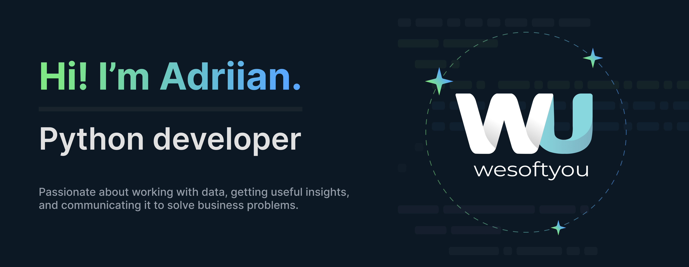

## Hi, I'm Adriian, a Skilled Backend-end Developer

I have over 4 years of experience in developing API and scripts with a strong focus on Python, Django, Django Rest Framework, FastAPI, AWS and other related technologies.

## Skills 🦾

- ✅ Api development\n
- ✅ Python, Django, Django Rest Framework, FastAPI, Scrapy
- ✅ Docker, AWS, NGINX
- ✅ Critical thinking skills
- ✅ Ability to navigate various data environments
- ✅ Hands-on technical ability in data
- ✅ Understanding of clients' business
- ✅ Collaboration with cross-functional teams

## Work Experience

I have worked with different departments and collaborated with business managers, systems architects, engineering delivery teams, project managers, QA, and operations teams. I connect with Product and Engineering teams to produce instrumentation that generates insightful measurements on new and existing products.

## Responsibilities
📌 Delivering testable, maintainable, and high-quality code.

📌 Performing troubleshooting efforts and investigations when necessary.

📌 Providing ongoing support, monitoring, and maintenance of deployed products.

📌 Coding re-engineering & legacy application enhancement.

📌 Reviewing code & controlling code quality.

📌 Actively working with less experienced software engineers providing technical guidance and oversight.

📌 Onboarding newcomers on the project.

📌 Providing proactiveness and deep knowledge of the technologies during apps development worked with code refactoring, system optimization, and improvements.

## Most recent projects 
### Project 1: 
Real-time chat with attached data and multiple metrics to improve team communication.
### Project 2:
Healthcare product for improving client management for private clinics and personal doctors.
### Project 3:
A heavily loaded E-commerce product for antique retail from leading antique dealers.

